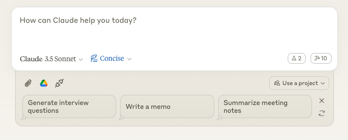
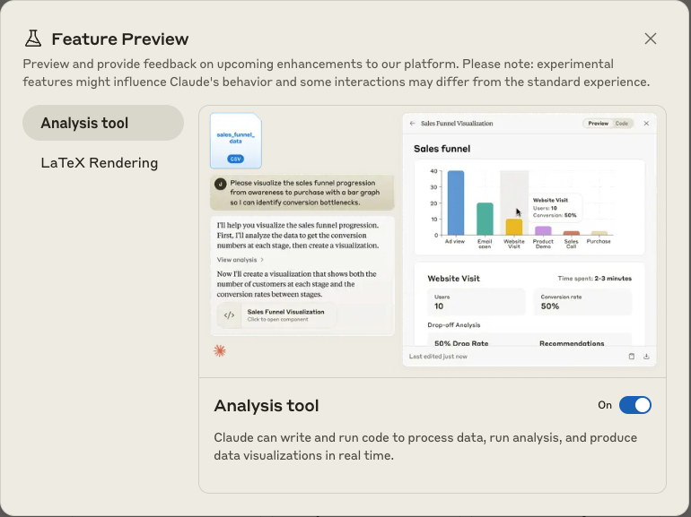
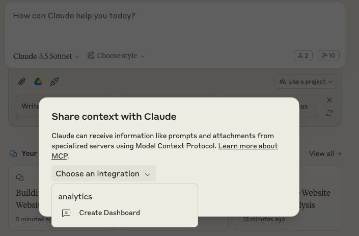

# analytics_service MCP Server

A Model Context Protocol (MCP) server that enhances Claude's capabilities by providing access to website analytics data from Umami. This server allows Claude to analyze user behavior, track website performance, and provide data-driven insights.

The codebase has been generated from start to finish using Claude Sonnet 3.5 and Cursor.


## What It Does

This server connects Claude to your Umami analytics platform, enabling it to:
- Analyze user journeys and behavior patterns
- Track website performance metrics
- Monitor real-time visitor activity
- Capture and analyze webpage content
- Generate insights from historical analytics data

## How It Works

The server acts as a bridge between Claude and the Umami API, implementing several specialized tools:

### Analytics Tools
- **Website Statistics**: Get overall metrics like pageviews, unique visitors, and bounce rates
- **User Journey Analysis**: Track individual user sessions and their interactions
- **Real-time Monitoring**: Monitor active visitors and current website activity
- **Time-series Analysis**: Analyze pageview trends over customizable time periods

### Content Analysis Tools
- **Screenshot Capture**: Get visual snapshots of webpages
- **HTML Analysis**: Access and analyze webpage source code
- **Document Processing**: Process and analyze user journey data for insights using retrieval-augmented generation (RAG)

## Setup Guide

### Prerequisites

- install uv: `pip install uv`

1. **Claude Desktop Configuration**
   
   Add the following to your Claude Desktop config file:
   - MacOS: `~/Library/Application Support/Claude/claude_desktop_config.json`
   - Windows: `%APPDATA%/Claude/claude_desktop_config.json`

   ```json
   {
     "mcpServers": {
       "analytics_service": {
         "command": "uv",
         "args": [
           "--directory",
           "/path/to/analytics_service",
           "run",
           "analytics_service"
         ],
         "env": {
          "UMAMI_API_URL": "https://example.com",
          "UMAMI_USERNAME": "yourUmamiUsername",
          "UMAMI_PASSWORD": "yourUmamiPassword", 
          "UMAMI_TEAM_ID": "yourUmamiTeamId"
        }
       }
     }
   }
   ```
   Replace `/path/to/analytics_service` with the actual path to your analytics_service directory.

   For the UMAMI_API_URL, replace `https://example.com` with the URL of the version of Umami you are using (either self-hosted or hosted on Umami Cloud). 

2. **Opening Claude Desktop**

  When you open Claude Desktop, it will automatically begin to connect to the analytics_service MCP server. Allow up to a few minutes as the server is initialised and the correct packages are installed. When the server is ready, you will see 10 MCP tools available in the bottom right of the chat window. This is signified with a small hammer icon and the number 10 next to it.

  

  Additionally, if you haven't already, it is strongly recommended that you enable the "Analysis tool" in Feature Preview within Claude Desktop. This will allow Claude to build you dashboards as well as other visualisations for your data. To do this, in the left-hand side panel, find the "Feature Preview" tab and in it, enable the "Analysis tool". LaTeX Rendering can also be enabled in the same section.

  

3. **Using the Server**
  ## Getting Started

  The simplest way to start is to use the Create Dashboard Prompt provided by the server. This is selected by clicking the "Attach from MCP" attachment button at the bottom left of the chat window. Then selecting chose implementation and then the Create Dashboard Prompt.

  

  This will guide you through the process of creating a dashboard for your website, asking for:
  1. The name of the website you want to analyze
  2. The start and end dates for the analysis
  3. The timezone of the website

  Once you have provided this information, the server will generate a txt file instructing Claude how to build the dashboard.
  Press enter in the chat window and Claude will do the rest. You can then ask Claude to make any changes to the dashboard or add any other visualisations.

  

  ## Advanced Usage

  For a more customisable experience, you can talk directly to Claude and specify your own requirements such as what data you want to see on the dashboard and what visualisations you want to use. Additionally you can analyse user journeys to pinpoint specific pain points and add screenshots from your site to give Claude extra context

  All of these tools will be used by claude automatically, simply make your request as plain text and claude will use what it thinks is the appropriate tool. If you want to see a list of all the tools available, you can ask claude to list them for you or click on the hammer icon in the bottom right of the chat window.
  
  
  
  